# API Universidades

Api rest simples com o intuito de consultas de cursos e campus de universidades publicas brasileiras.

## Tecnologias
<div style="display:inline-block;">
  

  
  
</div>     


## Documentação da API

### Status
- Retorna o status atual da aplicação. 
```bash
  GET /universidades/status
```
 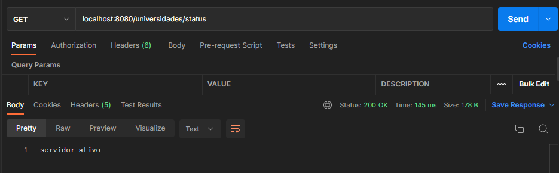


### Lista de universidades

- Retorna uma lista de todas as universidades públicas brasileiras.

```bash
  GET /universidades/universidade/listar
```
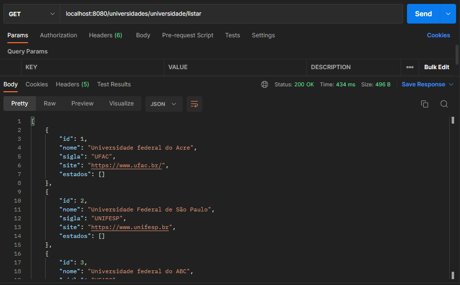

### Lista de universidades por estados
-  Retorna uma lista de todas as universidades públicas brasileiras por estado.
```bash
  GET /universidades/universidade/estado/{sigla}
```
| Parâmetro   | Tipo       | Descrição                                   |
| :---------- | :--------- | :------------------------------------------ |
| `sigla`      | `string` | **Obrigatório**. A sigla do estado desejado.|

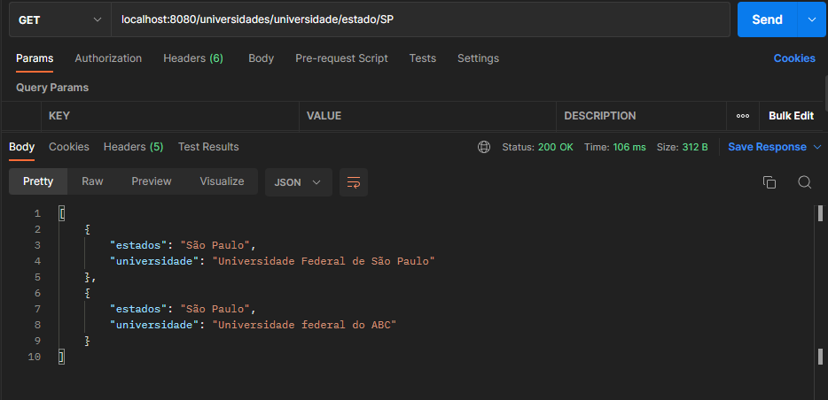

### Lista de universidades por curso
- Retorna uma lista de todas as universidades publicas brasileiras por curso.
```bash
  GET /universidades/universidade/curso/{curso}
```
| Parâmetro   | Tipo       | Descrição                                   |
| :---------- | :--------- | :------------------------------------------ |
| `curso`      | `string` | **Obrigatório**. O nome do curso desejado.|

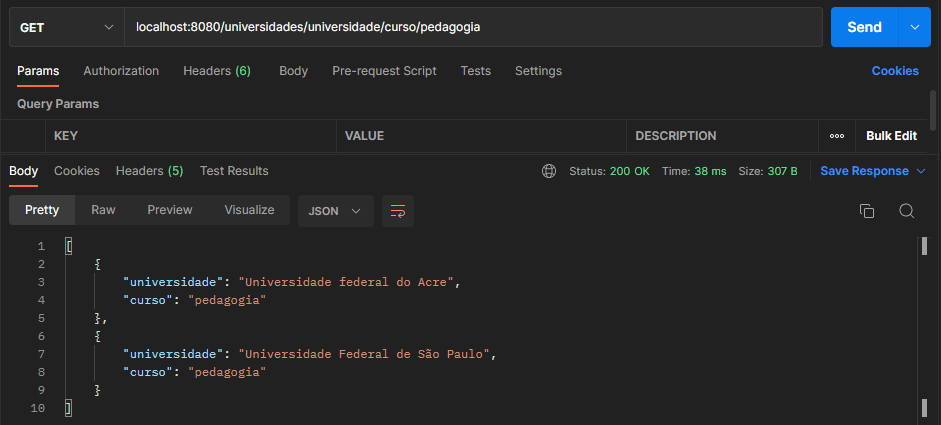

### Lista de cursos
- Retorna uma lista de todos os cursos.
```bash
  GET /universidades/curso/listar
```
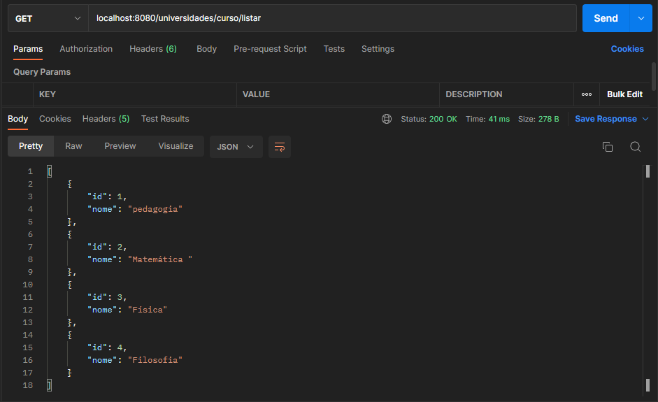

### Lista de curso por universidade
- Retorna uma lista de todos os cursos por universidade.
```bash
  GET /universidades/curso/universidade/{sigla}
```
| Parâmetro   | Tipo       | Descrição                                   |
| :---------- | :--------- | :------------------------------------------ |
| `sigla`      | `string` | **Obrigatório**. A sigla da universidade desejada.|

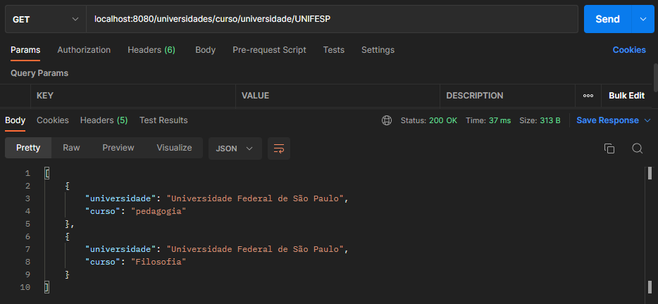

### Lista de curso por campus
- Retorna uma lista de todos os curso por campus da universidade desejada.
```bash
  GET /universidades/curso/campus/{cidade}
```
| Parâmetro   | Tipo       | Descrição                                   |
| :---------- | :--------- | :------------------------------------------ |
| `cidade`      | `string` | **Obrigatório**. A cidade do campus desejado.|

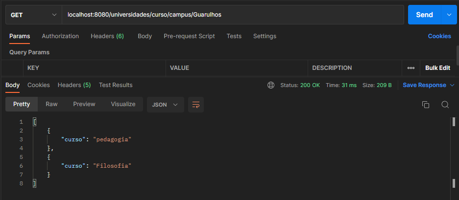

### Lista de curso por estado
- Retorna uma lista de todos os cursos disponiveis no estado desejado.
```bash
  GET /universidades/curso/estado/{sigla}
```
| Parâmetro   | Tipo       | Descrição                                   |
| :---------- | :--------- | :------------------------------------------ |
| `sigla`      | `string` | **Obrigatório**. A sigla do estado desejado.|

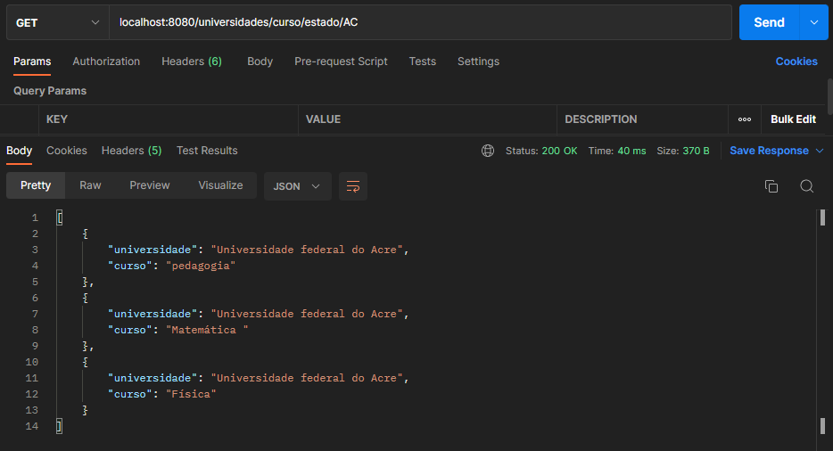

### Lista de campus
- Retorna uma lista de todos os campus disponiveis.
```bash
  GET /universidades/campus/listar
```

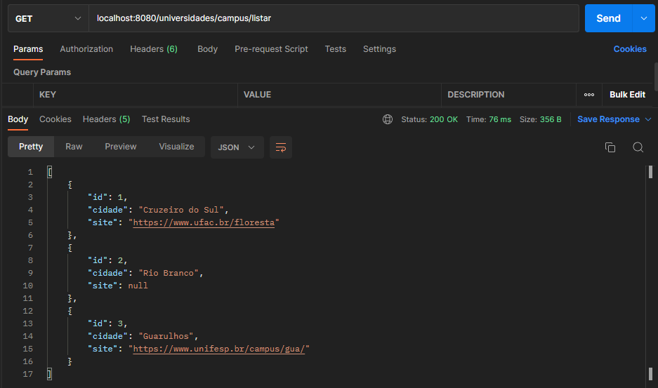

### Lista de campus por universidade
- Retorna uma lista de todos os campus da universidade desejada.
```bash
  GET /universidades/campus/universidade/{sigla}
```
| Parâmetro   | Tipo       | Descrição                                   |
| :---------- | :--------- | :------------------------------------------ |
| `sigla`      | `string` | **Obrigatório**. A sigla da universidade desejada.|

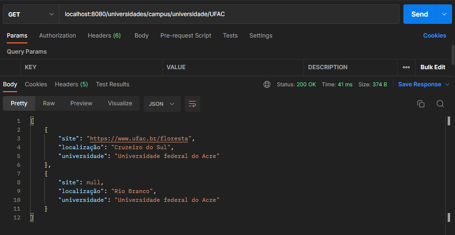

### Lista de estado
- Retorna uma lista de todos os estados.
```bash
  GET /universidades/estado/listar
```
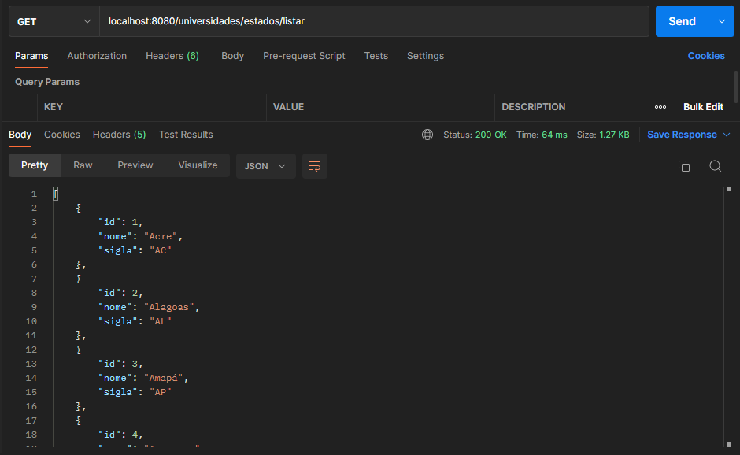


### Lista de estados por curso
- Retorna uma lista de todos os estados que oferecem o curso desejado.
```bash
  GET /universidades/estado/curso/{curso}
```
| Parâmetro   | Tipo       | Descrição                                   |
| :---------- | :--------- | :------------------------------------------ |
| `curso`      | `string` | **Obrigatório**. O nome do curso desejado.|

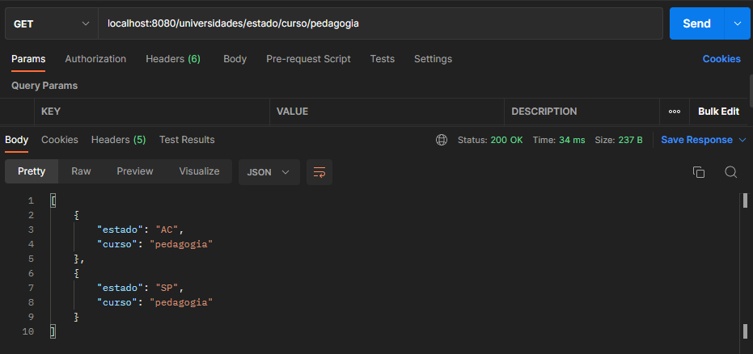
